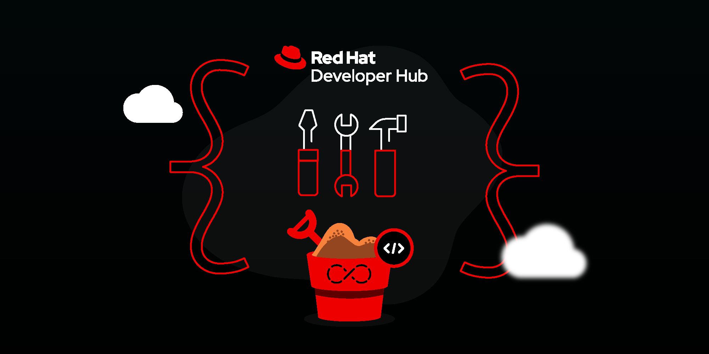

Using the following MKdocs extensions can enhance your TechDocs, making the user experience richer and more appealing for the reader. These samples were developed based on the reference documentation [here](https://squidfunk.github.io/mkdocs-material/reference/). View the source code of this page to discover the correct markup to use for each item displayed below.

!!! tip "View The Source"
    View the source code of this page to see all the mkdocs extension commands used to create it.

## Quotes

!!! quote "This is a quote"
    You don't have to add a title to a quote, they're optional.

## Callouts (Admonitions)

There are lots of types to choose from. You don't have to add a title to an admonition, they're optional. See [here](https://squidfunk.github.io/mkdocs-material/reference/admonitions/).

!!! info "This is an Info Card"
    There are lots of types to choose from. See [here](https://squidfunk.github.io/mkdocs-material/reference/admonitions/).

!!! warning "This is a Warning Card"
    This callout contains a warning.

!!! note "This is a Note Card"
    This callout contains a note.

!!! tip "This is a Tip Card"
    This callout contains a tip.

???+ question "This Question Card is Expanded (But Can Be Collapsed)"
    This card is expanded by default (but can be contracted using the side arrow).

??? success "This Success Card is Contracted (But Can Be Expanded)"
    This was contracted by default (but can be expanded using the side arrow).

## Content Tabs

Particularly useful for code blocks for different programming languages or platforms, but could have many other users.

=== "Mac OS & Linux"

    ```bash
    # Extract the tar archive into your ~/downloads directory
    tar -xvf my-bundle.tar -C ./downloads
    ```

=== "Windows"

    ```powershell
    # Extract the zip
    Expand-Archive .\my-bundle.zip
    ```

=== "Text"

    You can have what you like in here, just like an admonition. It doesn't *have* to be code blocks :smile:.

## Buttons

You can add buttons to your pages for great looking calls-to-action!

[Subscribe to our newsletter](#){ .md-button }

## Footnotes

Lorem ipsum[^1] dolor sit amet, consectetur adipiscing elit.[^2]

[^1]: Lorem ipsum dolor sit amet, consectetur adipiscing elit.

[^2]:
    Lorem ipsum dolor sit amet, consectetur adipiscing elit. Nulla et euismod nulla. Curabitur feugiat, tortor non consequat finibus, justo purus auctor massa, nec semper lorem quam in massa.

## Text Formatting

Text can be {--deleted--} and replacement text {++added++}. This can also be combined into {~~one~>a single~~} operation. {==Highlighting==} is also
possible {>>and comments can be added inline<<}.

{==

Formatting can also be applied to blocks by putting the opening and closing
tags on separate lines and adding new lines between the tags and the content.

==}

- ==This was marked==
- ^^This was inserted^^
- ~~This was deleted~~

- Subtext H~2~O
- Supertext A^T^A

## Task Lists

Automatic rendering of Markdown task lists.

- [x] Phase 1
- [x] Phase 2
- [ ] Phase 3

## Emoji

:smile: You can use Emoji's in your writing! Find the shortcodes [here](https://emojipedia.org/) :heart:.

## Images

You can align, resize, and caption your images. Click a tab to see how.

=== "Image LEFT & RESIZE"

    { align=left width="200" }

    `{ align=left width="200" }`

=== "Image RIGHT & RESIZE"

    { align=right width="200" }

    `{ align=right width="200" }`

=== "Image CENTER & RESIZE"

    { align=center width="200" }

    `{ align=center width="200" }`

=== "Image CAPTIONS"
    
    <figure markdown>
      { width="300" }
      <figcaption>Red Hat Developer Hub.</figcaption>
    </figure>

    ```html
    <figure markdown>
      { width="300" }
      <figcaption>Red Hat Developer Hub.</figcaption>
    </figure>
    ```

## Special Lists

Below is a "definition list." Notice the indentation...

`Lorem ipsum dolor sit amet`

:   Sed sagittis eleifend rutrum. Donec vitae suscipit est. Nullam tempus
    tellus non sem sollicitudin, quis rutrum leo facilisis.

`Cras arcu libero`

:   Aliquam metus eros, pretium sed nulla venenatis, faucibus auctor ex. Proin
    ut eros sed sapien ullamcorper consequat. Nunc ligula ante.

    Duis mollis est eget nibh volutpat, fermentum aliquet dui mollis.
    Nam vulputate tincidunt fringilla.
    Nullam dignissim ultrices urna non auctor.

Below is a task list, with done and not done items...

- [x] Lorem ipsum dolor sit amet, consectetur adipiscing elit
- [ ] Vestibulum convallis sit amet nisi a tincidunt
- [ ] Aenean pretium efficitur erat, donec pharetra, ligula non scelerisque

## MDX truly sane lists

- `attributes`

- `customer`
  - `first_name`
    - `test`
  - `family_name`
  - `email`
- `person`
  - `first_name`
  - `family_name`
  - `birth_date`
- `subscription_id`

- `request`

## Tool tips

Links can have tool tips.

[Link with tool tip](https://example.com "I'm a tooltip!")

Link with tooltip (using the separate 'reference' syntax).

[Hover me][example]

[example]: https://example.com "I'm a tooltip!"

## Download Links

Linking to binary downloads is easy. Clicking the ling starts the download in the browser.

[Click To Download The Banner Image](./images/hero-banner.jpg){: download }

## Abbreviations & Acronyms

Define an abbreviation once and wherever it appears on the page it will be underlined. Hover over the underlined abbreviation and the expanded abbreviation is shown as a tool tip. No more wondering what "CNCF" stands for!

*[CNCF]: Cloud Native Compting Foundation

## Video

You can add an iFrame containing a video clip from YouTube or another media site.

<iframe
  width="672"
  height="378"
  src="https://www.youtube.com/embed/LB1w8hjBt5k"
  title="Red Hat Developer Hub Overview"
  frameborder="0"
  allow="picture-in-picture"
  allowfullscreen></iframe>

```html
<iframe
  width="672"
  height="378"
  src="https://www.youtube.com/embed/LB1w8hjBt5k"
  title="Red Hat Developer Hub Overview"
  frameborder="0"
  allow="picture-in-picture"
  allowfullscreen></iframe>
```

??? warning "Adding Video Requires Additional RHDH Configuration"
    Your admin must add the media hosting site as an `allowedIframeHost` in the `app-config.yaml`:

    ```yaml
    techdocs:
      sanitizer:
        allowedIframeHosts:
          - www.youtube.com
    ```
    
    And, your admin must also add a `backend.csp` exception to the `app-config.yaml`:
    
    ```yaml
    backend:
      csp:
        connect-src: ['https:']
        frame-src: 
          - https://www.youtube.com  # Add more hosts as needed
    ```
